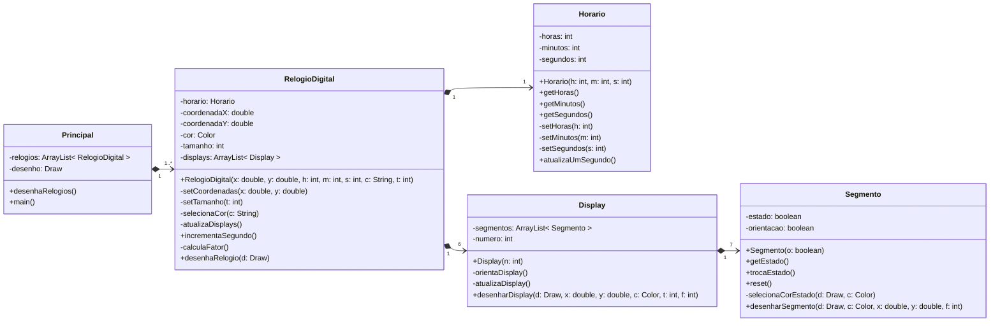

# Diagrama 

```mermaid
classDiagram
    direction LR

    class Principal {
        -relogios: ArrayList< RelogioDigital >
        -desenho: Draw
        +desenhaRelogios()
        +main()
    }

    class RelogioDigital{
        -horario: Horario
        -coordenadaX: double
        -coordenadaY: double
        -cor: Color
        -tamanho: int
        -displays: ArrayList< Display >
        +RelogioDigital(x: double, y: double, h: int, m: int, s: int, c: String, t: int)
        -setCoordenadas(x: double, y: double)
        -setTamanho(t: int)
        -selecionaCor(c: String)
        -atualizaDisplays()
        +incrementaSegundo()
        -calculaFator()
        +desenhaRelogio(d: Draw)
    } 
    
    class Horario {
        -horas: int 
        -minutos: int
        -segundos: int
        +Horario (h: int, m: int, s: int)
        +getHoras()
        +getMinutos()
        +getSegundos()
        -setHoras(h: int)
        -setMinutos(m: int)
        -setSegundos(s: int)
        +atualizaUmSegundo()
    } 

    class Display{
        -segmentos: ArrayList< Segmento >
        -numero: int
        +Display(n: int)
        -orientaDisplay()
        -atualizaDisplay()
        +desenharDisplay(d: Draw, x: double, y: double, c: Color, t: int, f: int)
        
    }

    class Segmento{
        -estado: boolean
        -orientacao: boolean
        +Segmento (o: boolean)
        +getEstado()
        +trocaEstado()
        +reset()        
        -selecionaCorEstado(d: Draw, c: Color)
        +desenharSegmento(d: Draw, c: Color, x: double, y: double, f: int)
    }

    RelogioDigital "1" *--> "1" Horario
    RelogioDigital "1" *--> "6" Display
    Display "1" *--> "7" Segmento
    Principal "1" *--> "1..*" RelogioDigital

``` 