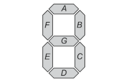
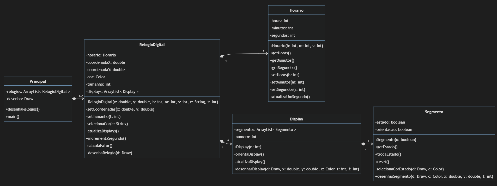
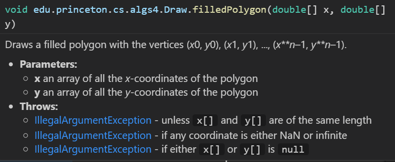
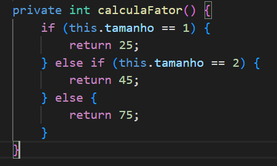
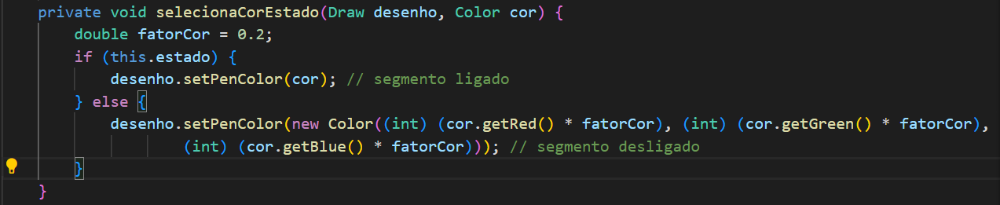

# Relógio Digital ⏰
> Autora: Luiza Kuze <br>
> Data: 24/10/2023 <br>
> Projeto final de POO

## Descrição 📌

O projeto é uma aplicação de um relógio digital, composto por 6 displays de 7 segmentos. Cada display de 7 segmentos é um dispositivo eletrônico acessível que pode representar informações alfanuméricas, ativando ou desativando individualmente seus 7 segmentos. 

Para ilustrar, se quisermos mostrar o número 2 em um display de 7 segmentos, ativamos os segmentos A, B, G, E e D.

<div align="center">
  


_Display 7 segmentos_

</div>


## Objetivos 🎯

- [x] Criar um relógio digital em Java que utilize 6 displays de 7 segmentos.

- [x] Permitir que o usuário defina as coordenadas de posicionamento do relógio no canvas.

- [x] Oferecer a opção de escolher o tamanho do relógio, variando de 1 a 3. Caso seja informado um tamanho inválido, coloca um relógio de tamanho 2 por padrão.

- [x] Personalizar a cor do relógio digital. Caso sejam cores não implementadas no desenvolvimento, desenha um relógio branco por padrão.

- [x] Inicializar o relógio com a hora, minutos e segundos especificados pelo usuário. Caso valores inválidos sejam fornecidos, o relógio começará às 00:00:00.

## Funcionamento 💻

### Opção 1 - Linux 👩🏻‍💻

```Bash
# Clonar o repositório do projeto 
git clone https://github.com/luizakuze/Digital-Clock

# Acessar o diretório 
cd Digital-Clock

# Compilar o projeto
./gradlew run
```


### Opção 2 - Windows 👨🏻‍💻

```Bash
# Clonar o repositório do projeto 
git clone https://github.com/luizakuze/Digital-Clock

# Acessar o diretório 
cd Digital-Clock

# Compilar o projeto
gradle run
```

## Diagrama UML 🌱

<div align="center">



_ [Diagrama do projeto]() _

</div>

## Implementação 📚

A fase de implementação envolveu aspectos essenciais como a representação dos segmentos, a atualização do tempo e a renderização gráfica. Abaixo estão alguns detalhes sobre:

### Representação Gráfica 🧁

Funciona por meio da biblioteca **_Algs4_**, uma biblioteca que oferece suporte para gráficos em 2D. Um grande suporte para o projeto ao utilizar a sua classe _**Draw**_! 

Na classe principal, um dos seus atributos é do tipo _**Draw**_ e ao instanciar um objeto dessa classe principal, criamos uma "tela de desenho" que será passada ao longo das classes e métodos do projeto.

Ok, então é o seguinte passo a passo:

1. Relógios são criados no método main da classe Principal.
2. Esses relógios tem horários definidos pelo usuário, que são responsabilidade da classe Horario.
3. Um relógio tem 6 displays, para representar horas, minutos e segundos. Assim, a responsabilidade de conectar o horário com os segmentos que aparecem é da classe Display.
4. Os displays podem acender e apagar, além disso também são desenhados na tela para representar um relógio digital!

Ao chegar na classe _**Segmento**_, cada segmento do display é desenhado como um polígono preenchido, utilizando o método _**filledPolygon**_ da classe _**Draw**_. Nessa etapa, é necessário um array de coordenadas x e y para desenhar um polígono.

<div align="center">



_documentação do método filledPolygon_
</div>

A solução é o cálculo das coordenadas de acordo com uma coordenada x e y inicial. Porém, é necessário atenção ao lembrar que os relógios pode possuir tamanhos diferentes. 

Ou seja, o cálculo das coordenadas foi realizado com base no tamanho do relógio escolhido (1, 2 ou 3). 

Além disso, um relógio pode possuir diferentes cores, então o polígono deve ser preenchido com a cor indicada pelo usuário.

As duas questões anteriores (tamanho e cor) do relógio são resolvidas com o fator de tamanho e fator de cor. 

<div align="center">



_método da classe RelogioDigital_



_método da classe Segmento_

</div>

## Licença 📜

Este projeto é licenciado sob a [MIT License](https://github.com/luizakuze/Contabilizador-Financeiro/blob/main/license)
